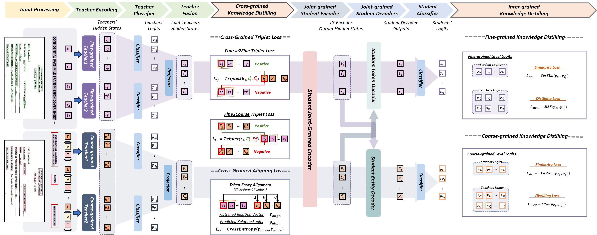

# [3MVRD: Multimodal Multi-task Multi-teacher Visually-Rich Form Document Understanding](https://arxiv.org/abs/2402.17983)
This paper presents a groundbreaking multimodal, multi-task, multi-teacher joint-grained knowledge distillation model for visually-rich form document understanding. The model is designed to leverage insights from both fine-grained and coarse-grained levels by facilitating a nuanced correlation between token and entity representations, addressing the complexities inherent in form documents. Additionally, we introduce new intra-grained and cross-grained loss functions to further refine diverse multi-teacher knowledge distillation transfer process, presenting distribution gaps and a harmonised understanding of form documents. Through a comprehensive evaluation across publicly available form document understanding datasets, our proposed model consistently outperforms existing baselines, showcasing its efficacy in handling the intricate structures and content of visually complex form documents. 

#### 
 Yihao Ding, Lorenzo Vaiani, Soyeon Caren Han, Jean Lee, Paolo Garza, Josiah Poon, Luca Cagliero 

#### 
 Accepted by Findings of the Association for Computational Linguistics (ACL 2024) 

## 3MVRD Model Architectures

## Methodology
Our paper interprets visually rich documents, especially form documents collaboratively created and used by multiple parties. We employ two tiers of multimodal information: fine-grained and coarse-grained levels, crucial for understanding the structure and content of form pages. Existing pre-trained visual-language models often focus on one of these aspects. Our approach integrates knowledge from diverse models to enhance document understanding for downstream tasks.

### Multimodal Multi-task Multi-teacher Joint-grained Document Understanding (Model Architecture)
We introduce a framework, $\mathcal{F}_{jg}$, designed to harness pre-trained knowledge from both fine-grained and coarse-grained levels, integrating insights from multiple pre-trained backbones. This unified approach aims to enhance the effectiveness of form understanding tasks.

#### Multimodal Multi-task Multi-Teacher
Our framework uses Multimodal Multi-teachers from two Multi-tasks, fine-grained and coarse-grained tasks. Details of teacher models and their impact are discussed in subsequent sections.

#### Joint-Grained Learning
The framework includes:

- **Joint-grained Encoder $\mathcal{E}$**: A transformer encoder designed to learn the contextual correlation between fine-grained and coarse-grained representations.
- **Joint-grained Decoders $\mathcal{D}$**: Processes augmented joint-grained representations, refining token and entity representations for a comprehensive document understanding.

### Multimodal Multi-task Multi-Teacher Knowledge Distillation
This section introduces a multi-loss strategy to enhance intra-grained and cross-grained knowledge exchange.

#### Task-oriented Cross Entropy Loss
Employs Cross Entropy loss for task-based knowledge distillation, guiding the learning process effectively for token and entity classification tasks.

#### Intra-Grained Loss Functions
These functions aim to distill knowledge from selected fine-tuned checkpoints to generate more representative token representations efficiently.

- **Similarity Loss**: Uses cosine similarity to align the understanding of label-based distribution.
- **Distilling Loss**: Uses Mean Squared Error for refining the knowledge transfer process between the student and teacher models.

#### Cross-Grained Loss Functions
These functions facilitate knowledge transfer by approximating the correlation between token and entity representations using self-attention and cross-attention mechanisms.

- **Cross-grained Triplet Loss**: Enhances joint-grained knowledge transfer by selecting more representative feature representations.
- **Cross-grained Alignment Loss**: Focuses on predicting the relations between tokens and entities, refining the joint-grained framework.

## Datasets

## 
